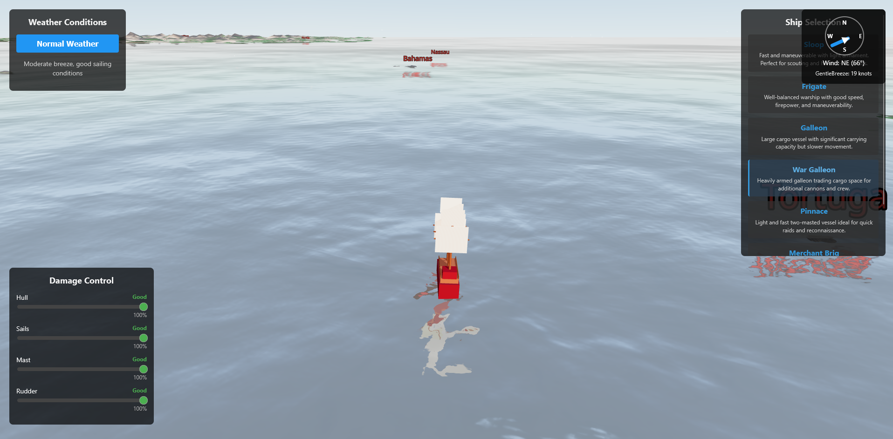

# High Seas

A 3D sailing adventure game built with React Three Fiber, where you navigate the Caribbean seas, battle other ships, and explore islands.



## Features

- Realistic ocean simulation with dynamic waves based on wind conditions
- Physics-based ship navigation with sail adjustments
- Interactive islands with unique landmasses and settlements
- Dynamic weather system including storms
- Compass and navigation tools
- Ship-to-ship combat

## Technologies

- **React** - Frontend UI framework
- **Three.js** - 3D rendering engine
- **React Three Fiber** - React renderer for Three.js
- **React Three Drei** - Useful helpers for React Three Fiber
- **TypeScript** - Type-safe JavaScript

## Installation

1. Clone the repository:
```bash
git clone https://github.com/yourusername/highseas.git
cd highseas
```

2. Install dependencies:
```bash
npm install
```

3. Start the development server:
```bash
npm start
```

## Controls

- **W/A/S/D** - Move ship forward/left/backward/right
- **Q/E** - Adjust sails
- **Mouse** - Look around when in free camera mode
- **Space** - Fire cannons (when implemented)
- **Tab** - Toggle UI

## Game Mechanics

### Wind and Sailing

The game features a realistic wind system that affects ship movement. The ship's speed is determined by:

- Wind direction relative to the ship
- Sail position
- Ship type and characteristics

### Islands and Navigation

Navigate between historically accurate Caribbean islands, with major settlements including:

- Port Royal
- Tortuga
- Nassau
- And many more

## Development Roadmap

- [x] Basic sailing mechanics
- [x] Island generation
- [x] Wind and weather systems
- [ ] Ship combat
- [ ] Trading system
- [ ] Ship upgrades
- [ ] NPC ships and AI
- [ ] Multiplayer support

## Contributing

Contributions are welcome! Please feel free to submit a Pull Request.

## License

This project is licensed under the MIT License - see the LICENSE file for details. 